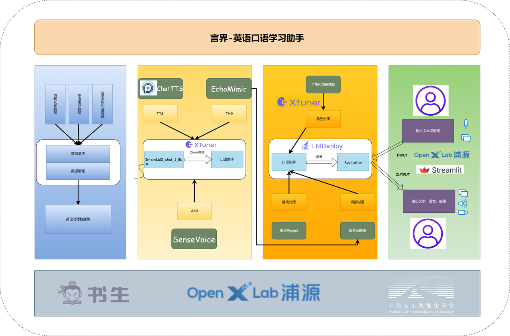
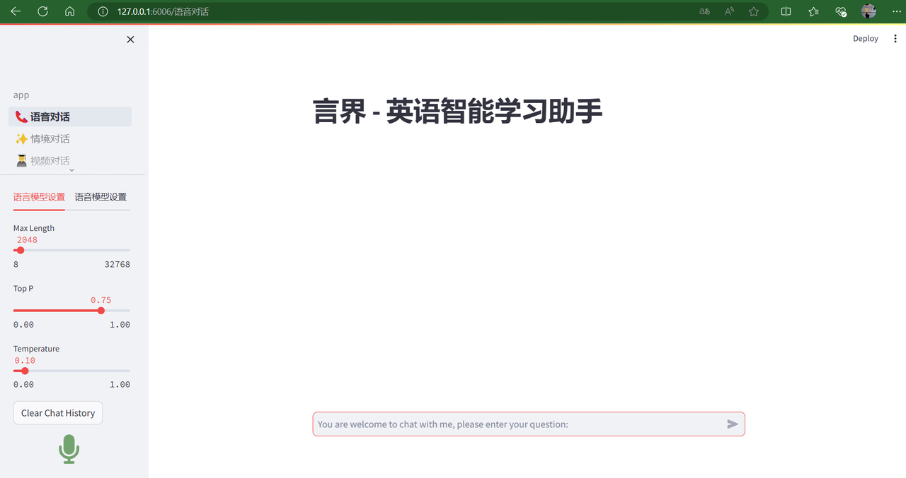
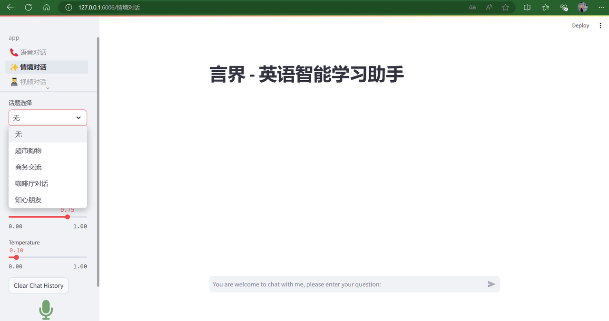
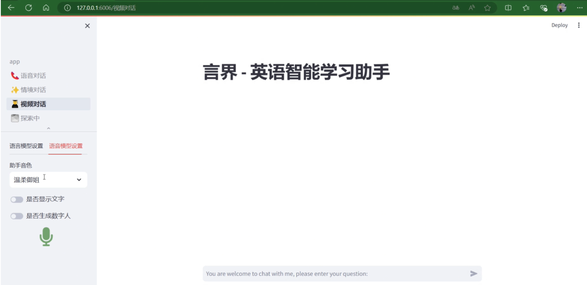

## 一. 项目介绍



### 1.1 **项目名称**

言界 - 英语智能学习助手

### 1.2 **项目概述**

言界是一款综合性的英语口语学习助手，基于InternLM大语言模型，欢迎大家参加书生浦语大模型实战营项目。项目旨在通过语音对话、情景对话、视频对话及模拟口语考试等功能，为用户提供沉浸式的英语学习体验。该项目将基于由上海人工智能实验室的**Xtuner，LMDeploy**等工具，结合**TTS**，**ASR**，并使用**InternLM2**系列模型进行实现。

### 1.3 **🔥项目目标：**

1. 提供语音对话功能，提高用户的英语口语水平。
2. 提供情境对话以及视频对话功能，提升用户的使用体验以及趣味性。
3. 提供模拟口语考试功能，帮助用户评估和提高英语水平。
4. 结合其他AI技术，提供个性化的伴读和伴写服务。

### 1.4 **🌟主要功能：**

1. **普通对话：** 支持日常语音对话。
2. **情景对话：** 利用图片引导大模型进行相关主题对话，模拟真实场景。
3. **视频通话：** 结合数字人技术，提供更自然的交流体验。
4. developing...

### 1.5 **🔄项目实施计划路线**

1. **普通对话：** ⬇




1. **情境对话：** ⬇




1. **视频通话：** ⬇




1. **其他功能...**

### 1.6 **🚀主要技术路线**

1. Xtuner微调
2. TTS语音合成技术
3. ASR语音识别技术
4. 多模态大语言模型
5. LMDeploy推理加速
6. OpenXlab部署Demo

## 二. 快速上手

### 2.1 环境搭建

```Plain
git clone https://github.com/Alannikos/Yanjie.git

conda env create -f env.yml
```

### 2.4 获取TTS，ASR，LLM，THG模型

| 模块 | 地址                                               |
| :--- | :------------------------------------------------- |
| LLM  | https://github.com/InternLM/InternLM               |
| TTS  | https://huggingface.co/2Noise/ChatTTS              |
| ASR  | https://huggingface.co/FunAudioLLM/SenseVoiceSmall |
| THG  | https://huggingface.co/BadToBest/EchoMimic         |

### 2.3 启动streamlit应用

```Plain
streamlit run app.py --server.address=127.0.0.1 --server.port=6006
```

## 三. **💕 致谢**

- **上海人工智能实验室**
- [InternLM/Tutorial: LLM&VLM Tutorial](https://github.com/InternLM/Tutorial)
- [OpenXlab](https://openxlab.org.cn/)
- [InternLM](https://github.com/InternLM/InternLM)
- [xtuner](https://github.com/InternLM/xtuner)
- [LMDeploy](https://github.com/InternLM/LMDeploy)
- [Linly-Talker: Digital Avatar Conversational System](https://github.com/Kedreamix/Linly-Talker)
- [Streamer-Sales: Streamer-Sales](https://github.com/PeterH0323/Streamer-Sales)
- [A Multi-modal RAG Project](https://github.com/chg0901/Honor_of_Kings_Multi-modal_Dataset)
- [OpenXLab-IntelligentSalesAssistant](https://github.com/wux-labs/OpenXLab-IntelligentSalesAssistant)
- [EchoMimic](https://huggingface.co/BadToBest/EchoMimic)
- [ChatTTS](https://huggingface.co/2Noise/ChatTTS)
- [SenseVoice](https://huggingface.co/FunAudioLLM/SenseVoiceSmall)
